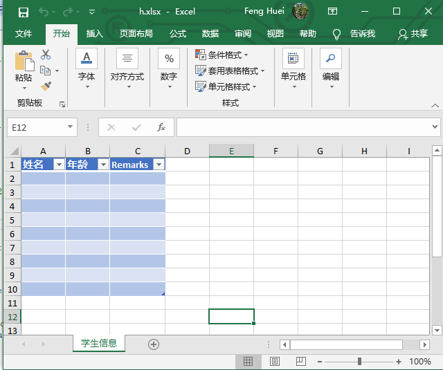
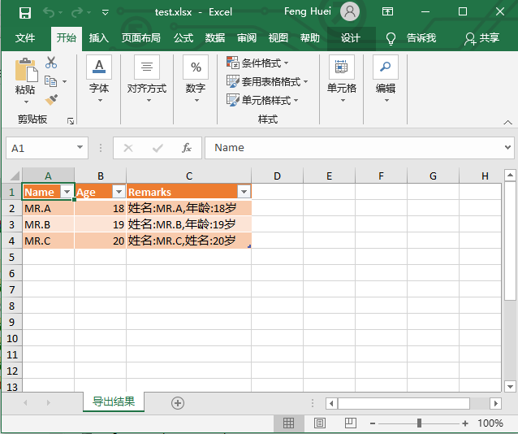
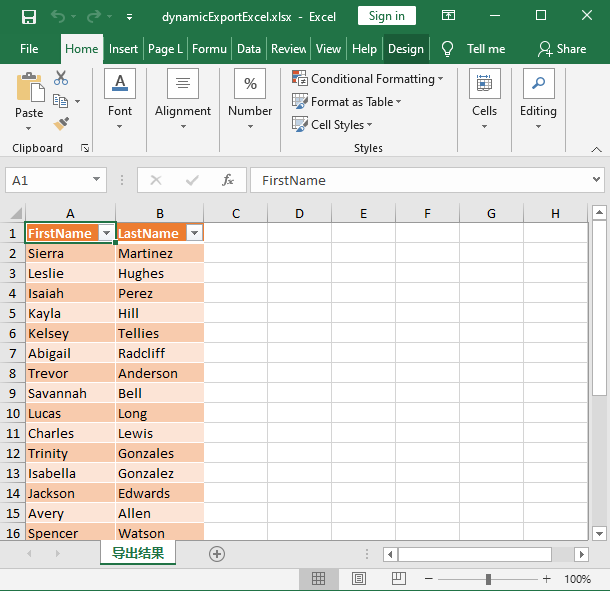

# 基础教程之导出Excel

## 说明

本教程主要说明如何使用Magicodes.IE.Excel完成学生数据的Excel导出。

## 要点

- 导出特性
- 如何导出Excel表头
- 如何导出数据、如何进行数据的切割、如何使用筛选器
- 支持dynamic/ExpandoObject类型的动态导出

## 导出特性

### ExporterAttribute

+ **Name**： 名称(当前Sheet 名称)
+ **HeaderFontSize**：头部字体大小
+ **FontSize**：正文字体大小
+ **MaxRowNumberOnASheet**：Sheet最大允许的行数，设置了之后将输出多个Sheet
+ **TableStyle**：表格样式风格
+ **AutoFitAllColumn**：***bool*** 自适应所有列
+ **Author**：作者
+ **ExporterHeaderFilter**：头部筛选器
+ **AutoCenter**：设置后可将整个表都进行居中

### ExporterHeaderAttribute

+ **DisplayName**： 显示名称
+ **FontSize**： 字体大小
+ **IsBold**： 是否加粗
+ **Format**： 格式化
+ **IsAutoFit**： 是否自适应
+ **IsIgnore**： 是否忽略
+ **AutoCenterColumn**： 设置列居中

### IEIgnoreAttribute

作用于属性和枚举成员。

+ **IsImportIgnore**：是否忽略导入，默认true
+ **IsExportIgnore**：是否忽略导出，默认true

### DescriptionAttribute

+ **Description**： Sheet导入导出标注

### DisplayFormatAttribute

+ **DataFormatString**：数据显示格式

### DisplayAttribute

+ **Name**
  + **导入导出的显示列名（属性）**
+ **Order**
  + **列索引** 
+ **Description**
  + **列描述** 

## 主要步骤

### 1.安装包Magicodes.IE.Excel

```powershell
Install-Package Magicodes.IE.Excel
```

### 2.导出Excel表头

- 通过数组导出

```csharp
     public async Task ExportHeader()
        {
            IExcelExporter exporter = new ExcelExporter();

            var filePath = "h.xlsx";
            var arr = new[] { "Name1", "Name2", "Name3", "Name4", "Name5", "Name6" };
            var sheetName = "Test";
            var result = await exporter.ExportHeaderAsByteArray(arr, sheetName);
            result.ToExcelExportFileInfo(filePath);

        }
```

- 通过DTO导出

```csharp
        public async Task ExportHeader()
        {
            IExporter exporter = new ExcelExporter();

            var filePath = "h.xlsx";
            var result = await exporter.ExportHeaderAsByteArray<Student>( new Student());
            result.ToExcelExportFileInfo(filePath);

        }
```




### 3.导出Excel

- 基础导出

```csharp
      
        public class Student
        {
            /// <summary>
            ///     姓名
            /// </summary>
            public string Name { get; set; }
            /// <summary>
            ///     年龄
            /// </summary>
            public int Age { get; set; }
        }

        public async Task Export()
        {
            IExporter exporter = new ExcelExporter();
            var result = await exporter.Export("a.xlsx", new List<Student>()
                {
                    new Student
                    {
                        Name = "MR.A",
                        Age = 18
                    },
                    new Student
                    {
                        Name = "MR.B",
                        Age = 19
                    },
                    new Student
                    {
                        Name = "MR.B",
                        Age = 20
                    }
                });
        }


```

通过如上代码我们可以将Excel导出，如下图所示



- 特性导出示例

```csharp

        public async Task Export()
        {
            IExporter exporter = new ExcelExporter();
            var result = await exporter.Export("test.xlsx", new List<Student>()
                {
                    new Student
                    {
                        Name = "MR.A",
                        Age = 18,
                        Remarks = "我叫MR.A,今年18岁",
                        Birthday=DateTime.Now
                    },
                    new Student
                    {
                        Name = "MR.B",
                        Age = 19,
                        Remarks = "我叫MR.B,今年19岁",
                        Birthday=DateTime.Now
                    },
                    new Student
                    {
                        Name = "MR.C",
                        Age = 20,
                        Remarks = "我叫MR.C,今年20岁",
                        Birthday=DateTime.Now
                    }
                });
        }
        /// <summary>
        ///     学生信息
        /// </summary>
        [ExcelExporter(Name = "学生信息", TableStyle = "Light10", AutoFitAllColumn = true, MaxRowNumberOnASheet = 2)]
        public class Student
        {
            /// <summary>
            ///     姓名
            /// </summary>
            [ExporterHeader(DisplayName = "姓名")]
            public string Name { get; set; }
            /// <summary>
            ///     年龄
            /// </summary>
            [ExporterHeader(DisplayName = "年龄")]
            public int Age { get; set; }
            /// <summary>
            ///     备注
            /// </summary>
            public string Remarks { get; set; }
            /// <summary>
            ///     出生日期
            /// </summary>
            [ExporterHeader(DisplayName = "出生日期", Format = "yyyy-mm-DD")]
            public DateTime Birthday { get; set; }
        }


```

通过如上代码我们可以将Excel导出，如下图所示


  1.  ExcelExporter特性可以设置导出的全局设置,比如表格样式,Sheet名称,自适应列等等具体参照 **导出特性**
  2.  ExporterHeader特性我们可以对表头名称、样式等等进行设置 具体参照 **导出特性**
  3.  ExcelExporter MaxRowNumberOnASheet 属性对数据进行拆分,通过该属性指定Sheet数据长度从而实现自动切割


- 表头筛选器

```csharp
        /// <summary>
        ///     学生信息
        /// </summary>
        [ExcelExporter(Name = "学生信息", TableStyle = "Light10", AutoFitAllColumn = true, MaxRowNumberOnASheet = 2,ExporterHeaderFilter = typeof(ExporterStudentHeaderFilter))]
        public class Student
        {
            /// <summary>
            ///     姓名
            /// </summary>
            [ExporterHeader(DisplayName = "姓名")]
            public string Name { get; set; }
            /// <summary>
            ///     年龄
            /// </summary>
            [ExporterHeader(DisplayName = "年龄",Format = "#,##0")]
            public int Age { get; set; }
            /// <summary>
            ///     备注
            /// </summary>
            public string Remarks { get; set; }
        }

        
        public class ExporterStudentHeaderFilter : IExporterHeaderFilter
        {
            /// <summary>
            /// 表头筛选器（修改名称）
            /// </summary>
            /// <param name="exporterHeaderInfo"></param>
            /// <returns></returns>
            public ExporterHeaderInfo Filter(ExporterHeaderInfo exporterHeaderInfo)
            {
                if (exporterHeaderInfo.DisplayName.Equals("姓名"))
                {
                    exporterHeaderInfo.DisplayName = "name";
                }
                return exporterHeaderInfo;
            }
        }
```

通过如上代码片段我们实现 **IExporterHeaderFilter** 接口,IExporterHeaderFilter以便支持多语言、动态控制列展示等场景

### 4.动态导出

```csharp
	class Program
    {
        static async Task Main(string[] args)
        {
            IExporter exporter = new ExcelExporter();
            // 生成测试数据
            var personList = GenFu.GenFu.ListOf<Person>();

            // 导出一个只包含"FirstName", "LastName"列的excel
            string fields = "FirstName,LastName"; // 可自定义导出想要的字段
            var expandoObjectList = new List<ExpandoObject>(personList.Count);
            var propertyInfoList = new List<PropertyInfo>();
            var fieldsAfterSplit = fields.Split(',');
            foreach (var field in fieldsAfterSplit)
            {
                var propertyName = field.Trim();
                var propertyInfo = typeof(Person).GetProperty(propertyName);

                if (propertyInfo == null)
                {
                    throw new Exception($"Property: {propertyName} 没有找到：{typeof(Person)}");
                }

                propertyInfoList.Add(propertyInfo);
            }

            foreach (var person in personList)
            {
                var shapedObj = new ExpandoObject();

                foreach (var propertyInfo in propertyInfoList)
                {
                    var propertyValue = propertyInfo.GetValue(person);
                    ((IDictionary<string, object>)shapedObj).Add(propertyInfo.Name, propertyValue);
                }

                expandoObjectList.Add(shapedObj);
            }

            string filePath = Path.Combine(Directory.GetCurrentDirectory(), "dynamicExportExcel.xlsx");
            var result = await exporter.ExportAsByteArray<ExpandoObject>(expandoObjectList);
            File.WriteAllBytes(filePath, result);
        }
    }


    class Person
    {
        public string FirstName { get; set; }
        public string LastName { get; set; }
        public string Title { get; set; }
        public int Age { get; set; }
        public int NumberOfKids { get; set; }
    }
```

通过如上代码我们可以将Excel导出，如下图所示


### 5.Enum&bool类型指定显示的值

```
[ValueMapping(text: "yes", true)]
[ValueMapping(text: "no", false)]
[ValueMapping(text: "小微客户", 0)]
```


